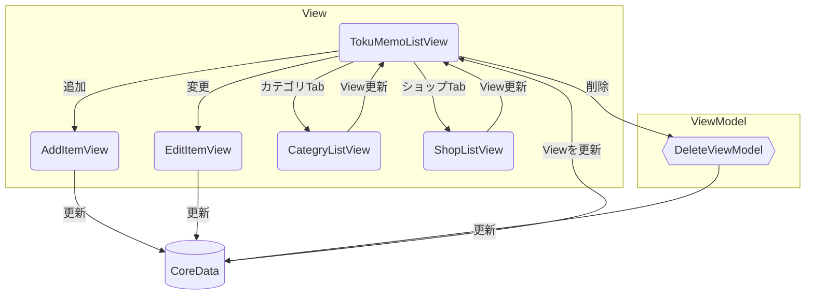
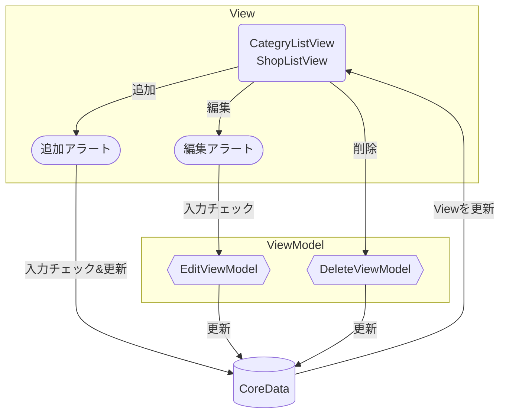
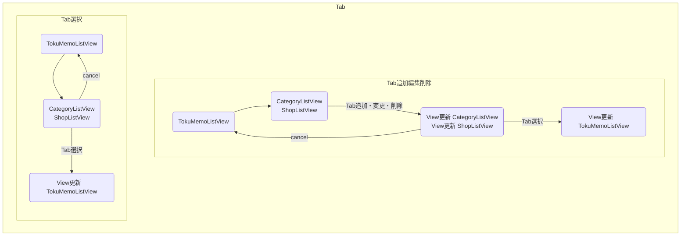

# トクメモ TokuMemo〜あなたのトクした瞬間を保管します〜

## 1. 概要
トクメモは買い物のトクした気持ちを保存するアプリです。<br>登録した最安値などの情報をカテゴリ、店舗毎にすぐにチェックできます。<br>登録した商品情報をカテゴリ、ショップの２つのTagで管理できます。
## 2. ダウンロードリンク


[](https://apps.apple.com/jp/app/%E3%83%88%E3%82%AF%E3%83%A1%E3%83%A2-tokumemo/id6444182651)
## 3. 実行画面
- 商品登録

https://user-images.githubusercontent.com/68992872/201657023-86fde2d9-5a0a-4363-a764-f97309ec3ba6.mp4

- 商品一覧表を抽出条件で更新します

https://user-images.githubusercontent.com/68992872/201657367-59244dc3-1a9e-40f7-bfd1-7113a6f5eaea.mp4

## 4. アプリの機能
- 商品価格、単価を一覧表示
- 商品の価格と単価は税込金額を入力します
- カテゴリ・ショップの組合せで一覧表示を切り替えます

## 5. アプリの設計について
|ファイル名|解説・概要|
|--|--|
|TokuMemoListView|抽出条件で商品一覧を表示するメインView|
|AddItemView|商品を追加登録するView|
|EditItemView|商品情報を変更するView|
|CategoryListView|カテゴリを選択、追加、編集、削除を行うView|
|ShopListView|ショップを選択、追加、編集、削除を行うView|
|CategoryShopTagView|カテゴリ、ショップのTabボタン、CategoryListView,ShopListView表示フラグ管理しているView|
|EditViewModel|カテゴリ、ショップの編集を処理します|
|DeleteViewModel|商品、カテゴリ、ショップの削除を処理します|
|||

- 商品テーブル



- カテゴリ・ショップテーブル

上記の表はJavaScriptライブラリ Mermaidを利用して、マークダウン記法で作図しています。

[Mermaidについて詳細はこちらから確認できます。](https://mermaid-js.github.io/mermaid/#/)
  

## 6. 苦労したポイント
### カテゴリ、ショップの値が変更した時に.onChangeイベントで抽出条件を更新
View更新するタイミングは下記のようにしました


### 問題. 商品変更登録後の条件更新が反映できない
#### 解決方法. 151行目のitems.nsPredicate = nil　抽出条件を初期化することで反映しました
https://github.com/ymp-a/tokuMemo/blob/a5b720fc36e4404f28fff5000942338699ec0b5a/tokuMemo/View/TokuMemoListView.swift#L148-L168


### DeletViewModelの関数deleteResultで商品、カテゴリ、ショップの削除処理を行います

#### before：.onDelete()を利用してレコードを左スワイプして削除

tokuMemo/tokuMemo/ViewModel/DeleteViewModel.swift
```swift
class DeleteViewModel {
    // generics<ジェネリック名：型指定>　optionクリック or 選択右クリックJump to Definition:プロトコルチェック
    // Item,Category,Shopに再利用可能な削除機能
    func deleteResult<Result: NSManagedObject>(offsets: IndexSet, result: FetchedResults<Result>, viewContext: NSManagedObjectContext) {
        // レコードの削除
        offsets.map { result[$0] }.forEach(viewContext.delete)
        // データベース保存
        do {
            try viewContext.save()
        } catch {
            let nsError = error as NSError
            fatalError("Unresolved error \(nsError), \(nsError.userInfo)")
        }// do catchここまで
    } // deleteItemsここまで
} // DeleteViewModelここまで
```

tokuMemo/tokuMemo/View/TokuMemoListView.swift
```swift
 .onDelete { indexSet in
                            deleteViewModel.deleteResult(offsets: indexSet, result: items, viewContext: context)
                        } // onDeleteここまで
```

#### after：3点リーダメニューからボタンタップで削除できるよう変更
https://github.com/ymp-a/tokuMemo/blob/271817c4b70799bdc1b1c599234a0e1fdaf80b23/tokuMemo/ViewModel/DeleteViewModel.swift#L11-L24 
https://github.com/ymp-a/tokuMemo/blob/271817c4b70799bdc1b1c599234a0e1fdaf80b23/tokuMemo/View/TokuMemoListView.swift#L129-L133

## 7. 開発環境
- Xcode 14.0.1
- macOS Ventura 13.0
- iPhone simulater 14.0.1
- iPhone実機 iOS16.0
  SwiftUIで開発されているためiOS16以降が必要です
  
## 8. 操作説明
本アプリの操作説明がわかるようなページを用意しました。<br>次のページをみていただくと使い方がわかります。<br>
[トクメモアプリの使い方｜ymp_a - note](https://note.com/ymp_a/n/n40460a324017)
## 9. 作成者
https://twitter.com/YMPa_FXSB103
## 10. ご意見
([問い合わせ](https://docs.google.com/forms/d/e/1FAIpQLSechH7A7sbCKsNdlG7AUxLwEffGEWgnq4CVrifFcn8_l53q1w/viewform?usp=sf_link)) ([プライバシーポリシー](PrivacyPolicy.md))
