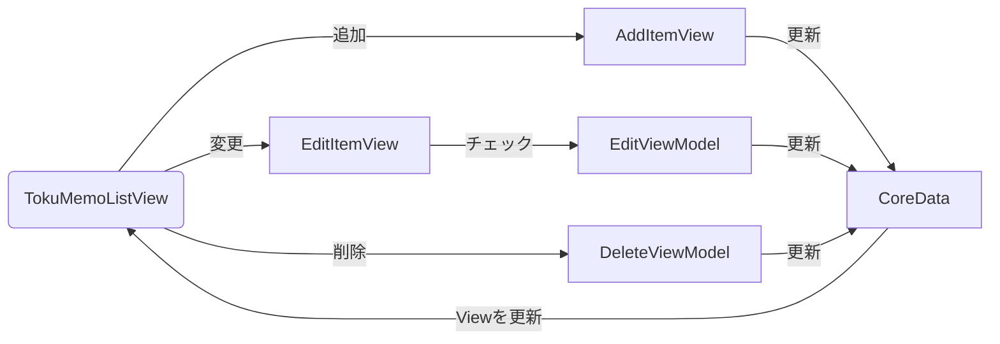

# トクメモ TokuMemo〜あなたのトクを貯めます〜

## 1. 概要
トクメモは買い物のトクした気持ちを保存するアプリです。 登録した最安値などの情報をカテゴリ、店舗毎にすぐチェックできます。 登録した商品情報をカテゴリ、ショップ２つのTagで管理できます。
## 2. ダウンロードリンク

## 3. 実行画面
- 商品登録

https://user-images.githubusercontent.com/68992872/201657023-86fde2d9-5a0a-4363-a764-f97309ec3ba6.mp4

- Tab組合せによる一覧表反映

https://user-images.githubusercontent.com/68992872/201657367-59244dc3-1a9e-40f7-bfd1-7113a6f5eaea.mp4

## 4. アプリの機能
- 商品追加、変更、削除
- カテゴリ、ショップTagの追加・変更・削除
- ホームTabの組合せで一覧表示を切り替え

## 5. アプリの設計について

## 6. こだわり
- Tabの組合せでList条件を反映する
- TabのViewを分割

## 7. 開発環境
- Xcode 14.0.1
- macOS Ventura 13.0
- iPhone simulater 14.0.1
- iPhone実機 iOS16.0
  SwiftUIで開発されているためiOS16以降が必要です
## 8. 作成者
https://twitter.com/YMPa_FXSB103
## 9. ライセンス

([問い合わせ](https://docs.google.com/forms/d/e/1FAIpQLSechH7A7sbCKsNdlG7AUxLwEffGEWgnq4CVrifFcn8_l53q1w/viewform?usp=sf_link)) ([プライバシーポリシー](PrivacyPolicy.md))
