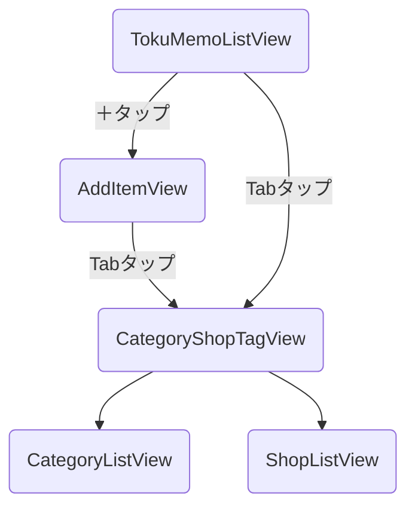

# tokuMemo
日々のお得を記録して買い物PDCAを回せるようにします。

# 画面フロー

```mermaid
flowchart TD

id1(TokuMemoListView)--"＋タップ"-->id2(AddItemView)--"Tabタップ"-->id3(CategoryShopTagView)-->id4(CategoryListView)
id1--"Tabタップ"-->id3
id3-->id5(ShopListView)

```
