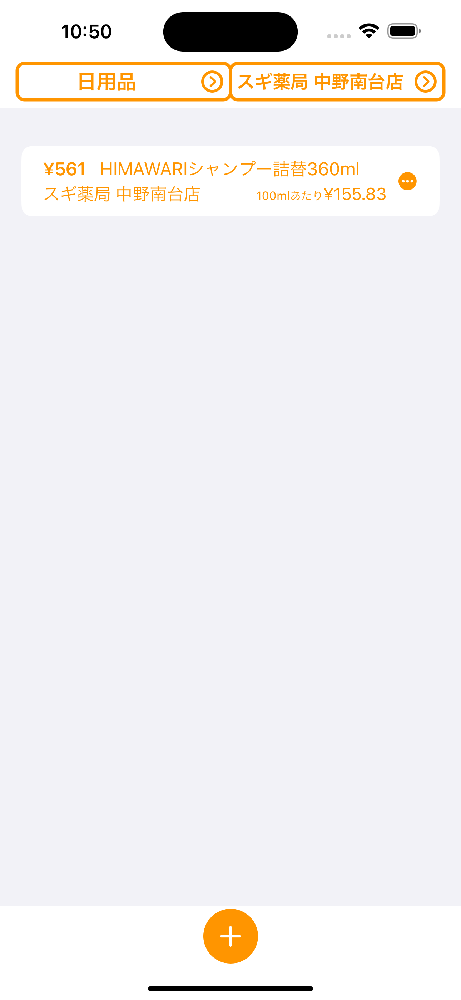

# トクメモ

## アプリの情報

| | |
| ------------------------------------------------------------ | ------------------------------------------------------------ |
| | トクメモを使うことで日常のおトクを記録管理できます。 一目で過去の最安値を確認できます。 悩む時間を減らして新たなトクを探しにいきましょう！ |
| |アプリの操作説明 起動したら+ボタンをタップして商品を登録します。|
||商品追加画面です。 商品名を入力して、カテゴリーとショップを選択します。|
||カテゴリー選択画面です。 ３つカテゴリーあります。追加する場合は右上の+ボタンから追加登録します。|
||ショップ選択画面です。 登録する店名を+ボタンから追加登録します|
||商品購入価格、割引価格、数量・単位、メモを入力します。|
||商品登録できました。|
||3点リーダー（・・・）をタップで編集削除ができます。|
||カテゴリー単位、ショップ単位で並替えが可能です。|

## ダウンロード

([問い合わせ](https://docs.google.com/forms/d/e/1FAIpQLSechH7A7sbCKsNdlG7AUxLwEffGEWgnq4CVrifFcn8_l53q1w/viewform?usp=sf_link)) ([プライバシーポリシー](PrivacyPolicy.md))
